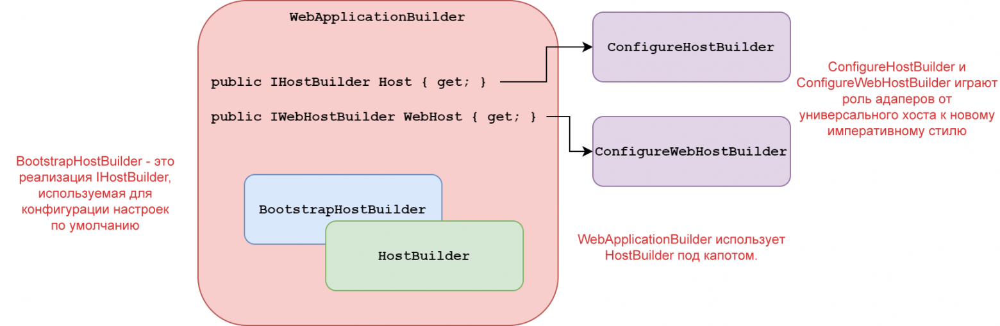

# Исследуем .NET 6–8. Часть 3. Рассматриваем код WebApplicationBuilder

**Автор:** Андрей (переводчик), .NET-разработчик  
**Дата публикации:** 27.08.2022 (адаптировано под .NET 6–8)  
**Теги:** .NET, ASP.NET Core, WebApplicationBuilder, .NET 6, .NET 8  

В предыдущем посте я сравнивал новый WebApplication с универсальным хостом. В этом посте я рассмотрю код, лежащий в основе WebApplicationBuilder, чтобы увидеть, как он обеспечивает более чистый, минимальный API хостинга, при этом обеспечивая ту же функциональность, что и универсальный хост.

## WebApplication и WebApplicationBuilder: новый способ начальной загрузки приложений ASP.NET Core

В .NET 6–8 представлен совершенно новый способ «начальной загрузки» приложения ASP.NET Core. Вместо традиционного разделения между Program.cs и Startup.cs весь код находится в Program.cs и является гораздо более процедурным, чем множество лямбда-методов, которых требовал универсальный хост в предыдущих версиях:

```csharp
WebApplicationBuilder builder = WebApplication.CreateBuilder(args);
builder.Services.AddRazorPages();

WebApplication app = builder.Build();

app.UseStaticFiles();

app.MapGet("/", () => "Hello World!");
app.MapRazorPages();

app.Run();
```

В язык C# добавлены различные обновления, которые делают всё это более чистым (операторы верхнего уровня, неявные директивы using, выведение типов в лямбдах и т. д.). Но также появились два новых типа: WebApplication и WebApplicationBuilder. В предыдущем посте я кратко описал, как использовать WebApplication и WebApplicationBuilder для настройки приложения ASP.NET Core. В этом посте мы рассмотрим их код, чтобы увидеть, как получился более простой API, при сохранении той же гибкости и настраиваемости, что и у универсального хоста.

## Создание WebApplicationBuilder

Первым шагом в нашем примере программы является создание экземпляра WebApplicationBuilder с использованием статического метода класса WebApplication:

```csharp
WebApplicationBuilder builder = WebApplication.CreateBuilder(args);
```

Это создаёт новый экземпляр WebApplicationOptions, инициализирует аргументы Args из аргументов командной строки и передаёт объект параметров в конструктор WebApplicationBuilder (показанный кратко ниже):

```csharp
public static WebApplicationBuilder CreateBuilder(string[] args) =>
    new(new() { Args = args });
```

Кстати, новое сокращённое ключевое слово new, когда целевой тип неочевиден, - просто отстой при разборе кода. Невозможно даже предположить, что создаёт второй new() в приведённом выше коде. Во многом претензии те же самые, как и к повсеместному использованию var, но в данном случае это меня особенно раздражает.

WebApplicationOptions предоставляет простой способ программного переопределения некоторых важных свойств. Если они не установлены, они будут выведены в значения по умолчанию, как и в предыдущих версиях .NET.

```csharp
public class WebApplicationOptions
{
    public string[]? Args { get; init; }
    public string? EnvironmentName { get; init; }
    public string? ApplicationName { get; init; }
    public string? ContentRootPath { get; init; }
}
```

Конструктор WebApplicationBuilder – это то место, где происходит большая часть магии, чтобы заставить работать концепцию минимального хостинга:

```csharp
public sealed class WebApplicationBuilder
{
    internal WebApplicationBuilder(WebApplicationOptions options)
    {
        // … показано ниже
    }
}
```

Я ещё не показал тело метода, так как в этом конструкторе много чего происходит и используется много вспомогательных типов. Мы вернёмся к ним через секунду, а пока сосредоточимся на публичном API WebApplicationBuilder.

## Публичный API WebApplicationBuilder

Публичный API WebApplicationBuilder состоит из набора свойств, доступных только для чтения, и одного метода Build(), который создаёт WebApplication.

```csharp
public sealed class WebApplicationBuilder
{
    public IWebHostEnvironment Environment { get; }
    public IServiceCollection Services { get; }
    public ConfigurationManager Configuration { get; }
    public ILoggingBuilder Logging { get; }

    public ConfigureWebHostBuilder WebHost { get; }
    public ConfigureHostBuilder Host { get; }

    public WebApplication Build()
}
```

Если вы знакомы с ASP.NET Core, вы заметите, что многие из этих свойств используют стандартные типы из предыдущих версий:

- IWebHostEnvironment – используется для получения имени среды, пути к корню контента и подобных значений.
- IServiceCollection – используется для регистрации сервисов в контейнере DI. Обратите внимание, что это альтернатива методу ConfigureServices(), используемому универсальным хостом для достижения того же результата.
- ConfigurationManager – используется как для добавления новой конфигурации, так и для получения значений конфигурации. См. первый пост в серии, где обсуждается этот вопрос.
- ILoggingBuilder – используется для регистрации дополнительных поставщиков журналов, как и в случае с методом ConfigureLogging() в универсальном хосте.

Свойства WebHost и Host интересны тем, что они предоставлены новыми типами ConfigureWebHostBuilder и ConfigureHostBuilder. Эти типы реализуют IWebHostBuilder и IHostBuilder соответственно и в основном представлены как замена для используемых ранее методов расширения.

Например, в предыдущем посте я показал, как можно зарегистрировать интеграцию Serilog с ASP.NET Core, вызвав UseSerilog() на свойстве Host:

```csharp
builder.Host.UseSerilog();
```

Раскрытие интерфейсов IWebHostBuilder и IHostBuilder было абсолютно необходимо для обеспечения возможности перехода к новому минимальному API хостинга WebApplication, но это также оказалось проблемой. Как согласовать конфигурацию в виде лямбд/обратных вызовов в IHostBuilder с императивным стилем в WebApplicationBuilder? Вот где в игру вступают ConfigureHostBuilder и ConfigureWebHostBuilder вместе с некоторыми внутренними реализациями IHostBuilder:



Мы начнём с рассмотрения публичных ConfigureHostBuilder и ConfigureWebHostBuilder.

## ConfigureHostBuilder

ConfigureHostBuilder и ConfigureWebHostBuilder были добавлены как часть обновлений для минимального хостинга. Они реализуют IHostBuilder и IWebHostBuilder соответственно. В этом посте мы подробно рассмотрим ConfigureHostBuilder:

```csharp
public sealed class ConfigureHostBuilder : IHostBuilder, ISupportsConfigureWebHost
{
    // ...
}
```

ConfigureHostBuilder реализует IHostBuilder, и похоже, что он реализует ISupportsConfigureWebHost, но взгляд на реализацию показывает, что это не так:

```csharp
IHostBuilder ISupportsConfigureWebHost.ConfigureWebHost(Action<IWebHostBuilder> configure, Action<WebHostBuilderOptions> configureOptions)
{
    throw new NotSupportedException($"ConfigureWebHost() не поддерживается WebApplicationBuilder.Host. Используйте вместо этого WebApplication, возвращаемый WebApplicationBuilder.Build().");
}
```

Это означает, что хотя следующий код и компилируется

```csharp
WebApplicationBuilder builder = WebApplication.CreateBuilder(args);
builder.Host.ConfigureWebHost(webBuilder =>
{
    webBuilder.UseStartup<Startup>();
});
```

он выбрасывает исключение NotSupportedException во время выполнения. Это явно не идеально, но это цена, которую мы платим за наличие хорошего императивного API для настройки сервисов и т. д. То же самое верно и для метода IHostBuilder.Build() – он выбросит NotSupportedException.

Видеть исключения времени выполнения никогда не доставляет радости, но это помогает думать о ConfigureHostBuilder как об «адаптере» для существующих методов расширения (таких как метод UseSerilog()), а не как о «реальном построителе» хоста. Это становится очевидным, когда вы видите, как такие методы, как ConfigureServices() или ConfigureAppConfiguration(), реализованы для этих типов:

```csharp
public sealed class ConfigureHostBuilder : IHostBuilder, ISupportsConfigureWebHost
{
    private readonly ConfigurationManager _configuration;
    private readonly IServiceCollection _services;
    private readonly HostBuilderContext _context;

    internal ConfigureHostBuilder(HostBuilderContext context, ConfigurationManager configuration, IServiceCollection services)
    {
        _configuration = configuration;
        _services = services;
        _context = context;
    }

    public IHostBuilder ConfigureAppConfiguration(Action<HostBuilderContext, IConfigurationBuilder> configureDelegate)
    {
        // Выполнить делегат немедленно, чтобы контекст и конфигурация были доступны в императивном коде
        configureDelegate(_context, _configuration);
        return this;
    }

    public IHostBuilder ConfigureServices(Action<HostBuilderContext, IServiceCollection> configureDelegate)
    {
        // Выполнить делегат немедленно, чтобы контекст и конфигурация были доступны в императивном коде configureDelegate(_context, _services);
        return this;
    }
}
```

Например, метод ConfigureServices() немедленно выполняет предоставленный делегат Action<>, используя внедрённую коллекцию IServiceCollection из WebApplicationBuilder. Таким образом, следующие два вызова функционально идентичны:

```csharp
// прямая регистрация типа MyImplementation в IServiceContainer
builder.Services.AddSingleton<MyImplementation>();
// «старый» метод ConfigureServices
builder.Host.ConfigureServices((ctx, services) => services.AddSingleton<MyImplementation>());
```

Последний подход явно не стоит использовать в обычной практике, но существующий код, который полагается на этот метод (например, методы расширения), все ещё можно использовать.

Не все делегаты, переданные методам в ConfigureHostBuilder, запускаются немедленно. Некоторые из них, например UseServiceProviderFactory(), сохраняются в списке и выполняются позже при вызове WebApplicationBuilder.Build()

Вот примерно и всё про тип ConfigureHostBuilder. ConfigureWebHostBuilder очень похож и действует как адаптер от предыдущего API к новому императивному стилю. Теперь мы можем вернуться к конструктору WebApplicationBuilder.

## Вспомогательный класс BootstrapHostBuilder

Прежде чем мы отвлеклись на ConfigureHostBuilder, мы собирались взглянуть на конструктор WebApplicationBuilder. Но мы еще не готовы к этому... сначала нужно взглянуть на ещё один вспомогательный класс, BootstrapHostBuilder.

BootstrapHostBuilder – это внутренняя реализация IHostBuilder, используемая в WebApplicationBuilder. В основном это относительно простая реализация, которая «запоминает» все полученные вызовы IHostBuilder. Например, функции ConfigureHostConfiguration() и ConfigureServices() выглядят следующим образом:

```csharp
internal class BootstrapHostBuilder : IHostBuilder
{
    private readonly List<Action<IConfigurationBuilder>> _configureHostActions = new();
    private readonly List<Action<HostBuilderContext, IServiceCollection>> _configureServicesActions = new();

    public IHostBuilder ConfigureHostConfiguration(Action<IConfigurationBuilder> configureDelegate)
    {
        _configureHostActions.Add(configureDelegate);
        return this;
    }

    public IHostBuilder ConfigureServices(Action<HostBuilderContext, IServiceCollection> configureDelegate)
    {
        _configureServicesActions.Add(configureDelegate);
        return this;
    }

    // ...
}
```

В отличие от ConfigureHostBuilder, который немедленно выполнял переданный делегат, BootstrapHostBuilder «сохраняет» переданные делегаты в список для последующего выполнения. Это похоже на то, как работает универсальный HostBuilder. Но обратите внимание, что BootstrapHostBuilder – это ещё одна «нестроящаяся» реализация IHostBuilder, в которой вызов Build() выдаёт исключение:

```csharp
public IHost Build()
{
    throw new InvalidOperationException();
}
```

Большая часть сложности BootstrapHostBuilder заключается в его методе RunDefaultCallbacks(ConfigurationManager, HostBuilder). Он используется для применения сохранённых делегатов в правильном порядке, как мы увидим позже.

## Конструктор WebApplicationBuilder

Наконец, мы дошли до конструктора WebApplicationBuilder. Он содержит много кода, поэтому я буду рассматривать его по частям.

Обратите внимание, что я позволил себе вольность удалить второстепенные фрагменты кода (например, защитные конструкции и тестовый код).

```csharp
public sealed class WebApplicationBuilder
{
    private readonly HostBuilder _hostBuilder = new();
    private readonly BootstrapHostBuilder _bootstrapHostBuilder;
    private readonly WebApplicationServiceCollection _services = new();

    internal WebApplicationBuilder(WebApplicationOptions options)
    {
        Services = _services;
        var args = options.Args;
        // ...
    }

    public IWebHostEnvironment Environment { get; }
    public IServiceCollection Services { get; }
    public ConfigurationManager Configuration { get; }
    public ILoggingBuilder Logging { get; }
    public ConfigureWebHostBuilder WebHost { get; }
    public ConfigureHostBuilder Host { get; }
}
```

Начнем с приватных полей и свойств. _hostBuilder – это экземпляр универсального хоста HostBuilder, который является «внутренним» хостом в WebApplicationBuilder. У нас также есть поле BootstrapHostBuilder (из предыдущего раздела) и экземпляр WebApplicationServiceCollection, являющийся реализацией IServiceCollection, которую я пока не буду рассматривать.

WebApplicationBuilder действует как «адаптер» для универсального хоста _hostBuilder, предоставляя императивный API, который я исследовал в моём предыдущем посте, сохраняя при этом ту же функциональность, что и универсальный хост.

К счастью, следующие шаги в конструкторе хорошо документированы:

```csharp
// Запуск методов для ранней настройки общих параметров и значений по умолчанию для веб-хоста, чтобы заполнить конфигурацию из appsettings.json,
// переменных среды (с префиксом DOTNET_ и ASPNETCORE_) и других возможных источников по умолчанию для предварительной установки
// правильных значений по умолчанию.
_bootstrapHostBuilder = new BootstrapHostBuilder(Services, _hostBuilder.Properties);

// Не указываем здесь args, поскольку мы хотим применить их позже, чтобы они
// могли перезаписать значения по умолчанию, указанные в ConfigureWebHostDefaults
_bootstrapHostBuilder.ConfigureDefaults(args: null);

// Мы указываем командную строку здесь последней, поскольку мы пропустили её при вызове ConfigureDefaults.
// args могут содержать настройки как хоста, так и приложения, поэтому мы хотим убедиться, что 
// мы соблюдаем правильный порядок провайдеров конфигурации без дублирования их
if (args is { Length: > 0 })
{
    _bootstrapHostBuilder.ConfigureAppConfiguration(config =>
    {
        config.AddCommandLine(args);
    });
}
```

После создания экземпляра BootstrapHostBuilder первым вызывается метод расширения HostingBuilderExtension.ConfigureDefaults(). Это тот же метод, который вызывается универсальным хостом при вызове Host.CreateDefaultBuilder().

Обратите внимание, что аргументы не передаются в вызов ConfigureDefaults(), а вместо этого применяются позже. В результате на этом этапе аргументы не используются для настройки конфигурации хоста (конфигурация хоста определяет такие значения, как имя приложения и среда хостинга).

Следующий вызов метода GenericHostBuilderExtensions.ConfigureWebHostDefaults(), который является тем же методом расширения, который мы обычно вызываем при использовании универсального хоста в ASP.NET Core 3.x/5.

```csharp
_bootstrapHostBuilder.ConfigureWebHostDefaults(webHostBuilder =>
{
    webHostBuilder.Configure(ConfigureApplication);

    // Нам нужно перезаписать имя приложения, поскольку вызов Configure установит его как имя вызывающей сборки.
    var applicationName = (Assembly.GetEntryAssembly())?.GetName()?.Name ?? string.Empty;
    webHostBuilder.UseSetting(WebHostDefaults.ApplicationKey, applicationName);
});
```

Этот метод по сути добавляет «адаптер» IWebHostBuilder поверх BootstrapHostBuilder, вызывает на нём WebHost.ConfigureWebDefaults(), а затем немедленно запускает переданный лямбда-метод. Это регистрирует метод WebApplicationBuillder.ConfigureApplication() для последующего вызова, который устанавливает целую кучу промежуточного ПО. Мы вернёмся к этому методу в следующем посте.

После настройки веб-хоста следующий метод применяет аргументы к конфигурации хоста, гарантируя, что они правильно переопределяют значения по умолчанию, установленные предыдущими методами расширения:

```csharp
// Применяем args к конфигурации хоста последними, поскольку ConfigureWebHostDefaults перезаписывает специфические для хоста настройки (имя приложения).
_bootstrapHostBuilder.ConfigureHostConfiguration(config =>
{
    if (args is { Length: > 0 })
    {
        config.AddCommandLine(args);
    }

    // Применяем options после args
    options.ApplyHostConfiguration(config);
});
```

Наконец, вызывается метод BootstrapHostBuilder.RunDefaultCallbacks(), который запускает все сохранённые обратные вызовы, которые мы накопили до сих пор, в правильном порядке, чтобы построить HostBuilderContext. Затем HostBuilderContext используется для окончательной установки остальных свойств в WebApplicationBuilder.

```csharp
Configuration = new();

// Это конфигурация приложения
var hostContext = _bootstrapHostBuilder.RunDefaultCallbacks(Configuration, _hostBuilder);

// Получаем WebHostBuilderContext из свойств для использования в ConfigureWebHostBuilder
var webHostContext = (WebHostBuilderContext)hostContext.Properties[typeof(WebHostBuilderContext)];

// Получаем IWebHostEnvironment из webHostContext. А также регистрирует экземпляр конфигурации в IServiceCollection.
Environment = webHostContext.HostingEnvironment;
Logging = new LoggingBuilder(Services);
Host = new ConfigureHostBuilder(hostContext, Configuration, Services);
WebHost = new ConfigureWebHostBuilder(webHostContext, Configuration, Services);

Services.AddSingleton<IConfiguration>(_ => Configuration);
```

Это конец конструктора. На этом этапе приложение настроено со всеми настройками по умолчанию для «хостинга»: конфигурация, ведение журнала, службы DI, среда и т. д.

Теперь вы можете добавить все свои собственные сервисы, дополнительную конфигурацию или ведение журнала в WebApplicationBuilder:

```csharp
WebApplicationBuilder builder = WebApplication.CreateBuilder(args);

// добавляем конфигурацию
builder.Configuration.AddJsonFile("sharedsettings.json");

// добавляем сервисы
builder.Services.AddSingleton<MyTestService>();
builder.Services.AddRazorPages();
 
// добавляем ведение журнала
builder.Logging.AddFile();

// строим!
WebApplication app = builder.Build();
```

Закончив настройку конкретного приложения, вы вызываете Build() для создания экземпляра WebApplication. В последнем разделе этого поста мы заглянем внутрь метода Build().

## Построение WebApplication в WebApplicationBuilder.Build()

Метод Build() не очень длинный, но его немного сложно понять, поэтому я рассмотрю его построчно:

```csharp
public WebApplication Build()
{
    // Копируем источники конфигурации в окончательный IConfigurationBuilder
    _hostBuilder.ConfigureHostConfiguration(builder =>
    {
        foreach (var source in ((IConfigurationBuilder)Configuration).Sources)
        {
            builder.Sources.Add(source);
        }

        foreach (var (key, value) in ((IConfigurationBuilder)Configuration).Properties)
        {
            builder.Properties[key] = value;
        }
    });

    // ...
}
```

Первое, что мы делаем, это копируем источники конфигурации, настроенные в ConfigurationManager, в реализацию ConfigurationBuilder _hostBuilder. Когда вызывается этот метод, построитель изначально пуст, поэтому он заполняет все источники, которые были добавлены как методами расширения построителя по умолчанию, так и дополнительные источники, которые вы настроили впоследствии.

Обратите внимание, что технически метод ConfigureHostConfiguration запускается не сразу. Скорее, мы регистрируем обратный вызов, который будет вызываться, когда мы далее вызовем _hostBuilder.Build().

Затем мы делаем то же самое для IServiceCollection, копируя их из экземпляра _services в коллекцию _hostBuilder. Комментарии здесь достаточно выразительные. В этом случае коллекция сервисов _hostBuilder не всегда пуста, но мы добавляем в неё всё из Services, а затем «сбрасываем» Services в экземпляр _hostBuilder.

```csharp
// Это нужно сделать здесь, чтобы избежать добавления IHostedService, который дважды загружает сервер (GenericWebHostService).
// Копируем сервисы, которые были добавлены через WebApplicationBuilder.Services, в окончательную коллекцию IServiceCollection
_hostBuilder.ConfigureServices((context, services) =>
{
    // На этом этапе мы добавили только сервисы, настроенные GenericWebHostBuilder и WebHost.ConfigureWebDefaults.
    // HostBuilder обновляет новую коллекцию ServiceCollection в HostBuilder.Build(), которую мы ещё не видели
    // до сих пор, поэтому мы не можем очистить эти сервисы, даже если некоторые из них избыточны, потому что
    // мы вызвали ConfigureWebHostDefaults как для _deferredHostBuilder, так и для _hostBuilder.
    foreach (var s in _services)
    {
        services.Add(s);
    }
    _services.InnerCollection = services;
});
```

В следующей строке мы запускаем все обратные вызовы, которые мы собрали в свойстве ConfigureHostBuilder, как я показывал выше.

Если они есть, то это обратные вызовы, такие как ConfigureContainer() и UseServiceProviderFactory(), которые обычно используются только в том случае, если вы используете сторонний контейнер DI.

```csharp
Host.RunDeferredCallbacks(_hostBuilder);
```

Наконец, мы вызываем _hostBuilder.Build() для создания экземпляра Host и передаём его новому экземпляру WebApplication. Вызов _hostBuilder.Build() – это то место, где вызываются все зарегистрированные обратные вызовы.

```csharp
_builtApplication = new WebApplication(_hostBuilder.Build());
```

Теперь нам надо сделать небольшую уборку. Чтобы всё было согласовано, экземпляр ConfigurationManager очищается и связывается с конфигурацией, хранящейся в WebApplication. Кроме того, IServiceCollection в WebApplicationBuilder помечается как доступный только для чтения, поэтому попытка добавить службы после вызова WebApplicationBuilder вызовет исключение InvalidOperationException. Наконец, возвращается построенное веб-приложение.

```csharp
((IConfigurationBuilder)Configuration).Sources.Clear();
Configuration.AddConfiguration(_builtApplication.Configuration);
_services.IsReadOnly = true;

return _builtApplication;
```

Это почти всё для WebApplicationBuilder, но мы ещё не выполнили обратный вызов ConfigureApplication(). В следующем посте мы рассмотрим код, лежащий в основе типа WebApplication, и увидим, где, наконец, вызывается ConfigureApplication().

## Итого

В этом посте мы рассмотрели часть кода нового API минимального хостинга WebApplicationBuilder. Я показал, как типы ConfigureHostBuilder и ConfigureWebHostBuilder действуют как адаптеры для универсального хоста и как BootstrapHostBuilder используется в качестве оболочки для внутреннего HostBuilder. Было довольно много запутанного кода только для создания экземпляра WebApplicationBuilder, но мы закончили статью, вызвав Build() для создания WebApplication. В следующем посте мы рассмотрим код WebApplication.

От переводчика  
* Продолжение серии планируется.  
* Дополнение для .NET 8: В .NET 8 WebApplicationBuilder получил улучшения в поддержке Native AOT, более эффективную обработку конфигурации и интеграцию с новыми функциями ASP.NET Core, такими как улучшенная маршрутизация. API остаются совместимыми, что обеспечивает плавный переход. Для деталей см. [Microsoft Docs по .NET 8](https://learn.microsoft.com/en-us/dotnet/core/whats-new/dotnet-8).

## Источники

1. Оригинальная статья: [ссылка на оригинал, если известна]  

**Теги:** .NET, ASP.NET Core, WebApplicationBuilder, .NET 6, .NET 8  
**Хабы:** Программирование, .NET, ASP.NET, Веб-разработка