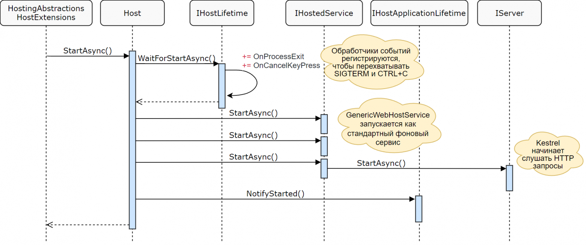
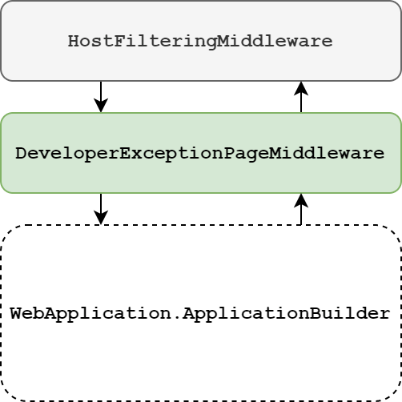
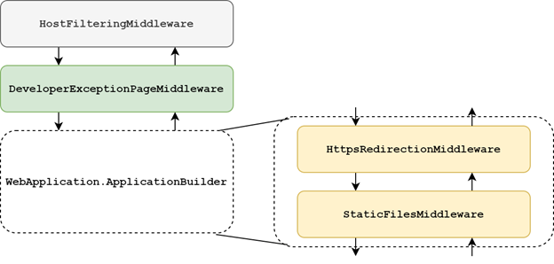
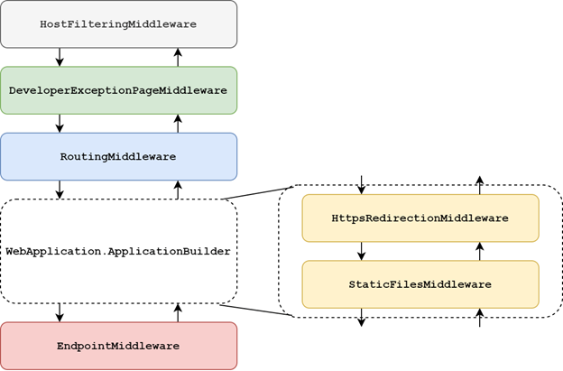
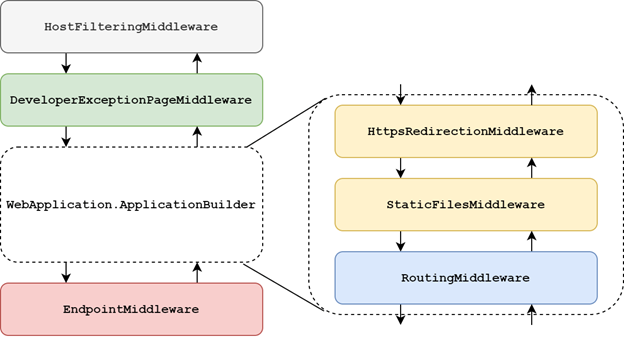
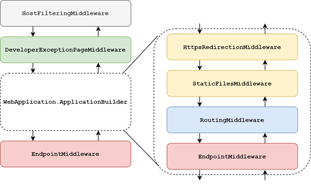

# Исследуем .NET 6–8. Часть 4. Создание конвейера промежуточного ПО в WebApplication

**Автор:** Андрей (переводчик), .NET-разработчик  
**Дата публикации:** 27.08.2022 (адаптировано под .NET 6–8)  
**Теги:** .NET, ASP.NET Core, WebApplication, Middleware, .NET 6, .NET 8  


Часть 1. ConfigurationManager
Часть 2. WebApplicationBuilder
Часть 3. Рассматриваем код WebApplicationBuilder

В моем предыдущем посте я рассмотрел код WebApplicationBuilder, включая некоторые из его вспомогательных классов, таких как ConfigureHostBuilder и BootstrapHostBuilder. В конце поста мы создали экземпляр WebApplicationBuilder и вызвали Build() для создания WebApplication. В этом посте мы немного рассмотрим код, лежащий в основе WebApplication, и сосредоточимся на настройке промежуточного ПО и конечных точек.

## WebApplication: «в предыдущих сериях»

Эта статья является прямым продолжением предыдущего поста о WebApplicationBuilder, а также введения в WebApplication, поэтому я предлагаю вам начать с этих статей, если вы их ещё не читали. Тем не менее, я не собираюсь сильно углубляться в код в этой статье по сравнению с предыдущей!

Как я описал в предыдущей статье, WebApplicationBuilder – это то место, где вы выполняете большую часть настройки приложения, в то время как WebApplication используется для трёх основных целей:

- Настройки конвейера промежуточного программного обеспечения, поскольку он реализует IApplicationBuilder.
- Настройки конечных точек с помощью MapGet(), MapRazorPages() и т. д., поскольку он реализует IEndpointRouteBuilder.
- Фактического запуска приложения, через вызов Run(), потому что он реализует IHost.

В конце предыдущей статьи мы увидели, что, когда вы вызываете Build() на экземпляре WebApplicationBuilder, создаётся приватный экземпляр универсального хоста Host, который передаётся в конструктор WebApplication. Эта статья продолжится с этого момента, чтобы дать небольшое представление о WebApplication, прежде чем мы начнём рассматривать конвейеры промежуточного ПО.

## WebApplication: относительно тонкая обёртка вокруг трёх типов

По сравнению с конструктором WebApplicationBuilder, конструктор WebApplication относительно прост:

```csharp
public sealed class WebApplication : IHost, IApplicationBuilder, IEndpointRouteBuilder, IAsyncDisposable
{
    private readonly IHost _host;
    private readonly List<EndpointDataSource> _dataSources = new();
    internal IDictionary<string, object?> Properties => ApplicationBuilder.Properties;

    internal static string GlobalEndpointRouteBuilderKey = "__GlobalEndpointRouteBuilder";

    internal WebApplication(IHost host)
    {
        _host = host;
        ApplicationBuilder = new ApplicationBuilder(host.Services);
        Properties[GlobalEndpointRouteBuilderKey] = this;
    }
    // ...
}
```

Конструктор и инициализаторы полей выполняют 4 основные задачи:

- Сохранить предоставленный хост в поле _host. Это тот же тип хоста, что и при прямом использовании универсального хоста, как в ASP.NET Core 3.x/5.
- Создать новый список EndpointDataSource. Источники конечных точек используются для настройки конечных точек в приложении, включая Razor Pages, контроллеры, конечные точки API и новые «минимальные» API.
- Создать новый экземпляр ApplicationBuilder. Он используется для создания конвейера промежуточного ПО и по сути является тем же типом, который использовался с версии 1.0!
- Установить свойство __GlobalEndpointRouteBuilder в ApplicationBuilder. Это свойство используется для «сообщения» другому промежуточному ПО, что мы используем новый WebApplication, у которого немного другие значения по умолчанию, как вы увидите немного позже.

WebApplication в основном делегирует реализацию IHost, IApplicationBuilder и IEndpointRouteBuilder своим приватным свойствам и реализует их явно. Например, для IApplicationBuilder большая часть реализации делегируется ApplicationBuilder, созданному в конструкторе:

```csharp
IDictionary<string, object?> IApplicationBuilder.Properties => ApplicationBuilder.Properties;

IServiceProvider IApplicationBuilder.ApplicationServices
{
    get => ApplicationBuilder.ApplicationServices;
    set => ApplicationBuilder.ApplicationServices = value;
}

IApplicationBuilder IApplicationBuilder.Use(Func<RequestDelegate, RequestDelegate> middleware)
{
    ApplicationBuilder.Use(middleware);
    return this;
}
```

Самое интересное начинается, когда вы вызываете RunAsync(), который строит конвейер промежуточного ПО.

## Запуск WebApplication и построение конвейера промежуточного ПО

Стандартный способ запустить приложение – вызвать app.Run() на WebApplication. Это вызывает WebApplication.RunAsync, который, в свою очередь, вызывает метод расширения IHost, HostingAbstractionsHostExtensions.RunAsync() – тот же самый метод, который вы использовали бы с универсальным хостом в 3.x/5. Это, в свою очередь, вызывает IHost.StartAsync, запускающий сложные взаимодействия при запуске, о которых я писал ранее*EN.



Как показано на диаграмме выше, в ходе запуска приложения Host запускает IHostedServices, зарегистрированные в приложении. Как часть переноса платформы в ASP.NET Core 3.x, веб-сервер стал также работать как IHostedService, поэтому именно в этот момент создаётся конвейер промежуточного ПО, а Kestrel начинает слушать запросы.

GenericWebHostService – это место, где создаётся конвейер промежуточного ПО, и, наконец, он передаётся в Kestrel для запуска вашего приложения. В этом процессе в WebApplication нет ничего особенного по сравнению с универсальным хостом, поэтому вместо того, чтобы углубляться в немаленький код запуска, мы рассмотрим, как WebApplication настраивает конвейер промежуточного ПО.

## Конвейер промежуточного ПО в WebApplication

Одно из серьёзных отличий WebApplication от универсального хоста заключается в том, что WebApplication по умолчанию устанавливает различное промежуточное ПО. В предыдущей статье я показал, что WebApplicationBuilder вызывает GenericHostBuilderExtensions.ConfigureWebHostDefaults(). Этот метод также обычно используется в универсальном хосте и устанавливает несколько значений по умолчанию:

- Настраивает Kestrel
- Добавляет промежуточное ПО HostFiltering
- Добавляет промежуточное ПО ForwardedHeaders, если для переменной среды ASPNETCORE_FORWARDEDHEADERS_ENABLED задано значение true.
- Обеспечивает интеграцию с IIS

В дополнение к этому WebApplicationBuilder устанавливает дополнительное промежуточное ПО. Здесь на помощь приходит метод ConfigureApplication, о котором я упоминал в предыдущей статье. В зависимости от того, как вы настраиваете свой WebApplication, ConfigureApplication добавляет дополнительное промежуточное ПО в ваш конвейер.

Код этого немного сложен, так как требует обработки множества крайних случаев. Вместо того, чтобы углубляться в код слишком подробно, мы рассмотрим несколько примеров того, как выглядит конечный конвейер промежуточного ПО.

### Пустой конвейер

Мы начнём с самого простого (и несколько бессмысленного) приложения, в котором мы не добавляем в приложение никакого дополнительного промежуточного ПО или конечных точек:

```csharp
WebApplicationBuilder builder = WebApplication.CreateBuilder(args);
WebApplication app = builder.Build();
app.Run();
```

Эта настройка является самой простой из конфигураций и приводит к конвейеру промежуточного ПО, содержащему:

- HostFilteringMiddleware
- DeveloperExceptionPageMiddleware
- «Пустое» промежуточное ПО, созданное в WebApplication.ApplicationBuilder.

что-то вроде следующего:



HostFilteringMiddleware добавляется благодаря скрытому вызову ConfigureWebHostDefaults(), как описано в предыдущем разделе. ForwardedHeadersMiddleware не был добавлен, поскольку не была добавлена переменная среды.

DeveloperExceptionPage теперь добавляется автоматически, когда вы работаете в среде разработки (Development). В начало каждого конвейера промежуточного ПО добавляется следующий код:

```csharp
if (context.HostingEnvironment.IsDevelopment())
{
    app.UseDeveloperExceptionPage();
}
```

Последний блок промежуточного ПО в конвейере состоит из промежуточного ПО, добавляемого непосредственно в WebApplication.ApplicationBuilder в Program.cs. В этом примере мы ничего не добавляли, поэтому, по сути, добавляем «пустой» конвейер.

Очевидно, что приложение, состоящее только из промежуточного ПО по умолчанию, не имеет большого смысла, поэтому давайте добавим базовое промежуточное ПО в WebApplication.

### Конвейер с дополнительным промежуточным ПО

В этом примере мы добавляем в конвейер дополнительное промежуточное ПО для статических файлов и для перенаправления HTTPS:

```csharp
WebApplicationBuilder builder = WebApplication.CreateBuilder(args);
WebApplication app = builder.Build();

// Добавляем дополнительное промежуточное ПО
app.UseHttpsRedirection();
app.UseStaticFiles();

app.Run();
```

При такой настройке у нас всё ещё есть то же трехэтапное промежуточное ПО, как и в предыдущем примере, но конвейер WebApplication.ApplicationBuilder теперь содержит два дополнительных экземпляра промежуточного ПО.

- HostFilteringMiddleware
- DeveloperExceptionPageMiddleware
- Конвейер WebApplication.ApplicationBuilder, содержащий
  - HttpsRedirectionMiddleware
  - StaticFilesMiddleware

Итак, теперь у нас есть что-то вроде этого:



У нас ещё нет конечных точек, поэтому в следующем примере мы добавим конечную точку «Hello World!».

### Конвейер "Hello world"

Ниже мы добавляем в предыдущий пример одну конечную точку для домашней страницы, которая возвращает текст «Hello World!»:

```csharp
WebApplicationBuilder builder = WebApplication.CreateBuilder(args);
WebApplication app = builder.Build();

app.UseHttpsRedirection();
app.UseStaticFiles();

// Добавляем единственную конечную точку
app.MapGet("/", () => "Hello World!");
app.Run();
```

Добавление конечной точки с помощью MapGet() добавляет запись в коллекцию EndpointDataSource объекта WebApplication, что приводит к тому, что ConfigureApplication автоматически добавляет дополнительное промежуточное ПО:

- HostFilteringMiddleware
- DeveloperExceptionPageMiddleware
- EndpointRoutingMiddleware (также известное как RoutingMiddleware)
- Конвейер WebApplication.ApplicationBuilder, содержащий
  - HttpsRedirectionMiddleware
  - StaticFilesMiddleware
  - EndpointMiddleware

Обратите внимание, что RoutingMiddleware автоматически добавляется в конвейер промежуточного ПО до начала конвейера, определённого в Program.cs, а EndpointMiddleware автоматически добавляется в конвейер в конце. В результате конвейер выглядит примерно так:



Интересно, что WebApplication скрывает от пользователей промежуточное ПО маршрутизации. Тот факт, что RoutingMiddleware и EndpointMiddleware настолько тесно связаны и что они налагают строгие требования к порядку (например, между ними должно быть размещено AuthorizationMiddleware), усложняет понимание этой концепции для новичков. С .NET 6 и WebApplication пользователям не нужно об этом беспокоиться!

Однако не все так радужно. Некоторые виды промежуточного ПО обычно предполагают, что они будут вызываться перед UseRouting(). Например, для обработки этого нового шаблона нужно было обновить*EN ExceptionHandlerMiddleware, RewriterMiddleware, StatusCodePagesMiddleware.

Но что, если вам нужно, чтобы промежуточное ПО маршрутизации находилось в определенной точке конвейера? Может быть, у вас есть промежуточное ПО, которое должно быть размещено, например, до промежуточного ПО маршрутизации?

### Конвейер с UseRouting()

В следующем примере мы явно добавляем EndpointRoutingMiddleware в конвейер WebApplication.ApplicationBuilder, вызывая UseRouting(). Это ближе к тому, что вы ожидаете увидеть в приложении .NET 3.x/5, где UseRouting() размещается в середине вашего конвейера.

```csharp
WebApplicationBuilder builder = WebApplication.CreateBuilder(args);
WebApplication app = builder.Build();

app.UseHttpsRedirection();
app.UseStaticFiles();

// EndpointRoutingMiddleware в середине конвейера.
app.UseRouting();

app.MapGet("/", () => "Hello World!");
app.Run();
```

Как и следовало ожидать, результирующий конвейер содержит всё то же промежуточное ПО, что и раньше, но расположеное в несколько другом порядке:

- HostFilteringMiddleware
- DeveloperExceptionPageMiddleware
- Конвейер WebApplication.ApplicationBuilder, содержащий
  - HttpsRedirectionMiddleware
  - StaticFilesMiddleware
  - EndpointRoutingMiddleware (RoutingMiddleware)
  - EndpointMiddleware

Это можно визуализировать примерно так:



Между «основным» конвейером промежуточного ПО и конвейером WebApplication.ApplicationBuilder существует интересное взаимодействие*EN, где WebApplicationBuilder должен следить за сохранением общего порядка при использовании UseRouting(). Надеюсь, это потребуется нечасто, но, когда это таки произойдет, вы всё равно при желании сможете использовать WebApplicationBuilder вместо того, чтобы вынужденно возвращаться к универсальному хосту.

Наконец, давайте посмотрим, что произойдет, если вы добавите другую сторону маршрутизации конечных точек, EndpointMiddleware.

### Конвейер с UseEndpoints()

Как я упоминал ранее, маршрутизация конечных точек работает в паре: EndpointRoutingMiddleware (так же известное как RoutingMiddleware), которое выбирает конечную точку, и EndpointMiddleware, которое исполняет конечную точку (подробнее о маршрутизации конечных точек). EndpointMiddleware обычно добавляется в конвейер в конце путем вызова UseEndpoints(), но с WebApplicationBuilder оно добавляется автоматически. Посмотрим, что произойдет, если мы также добавим его явно.

```csharp
WebApplicationBuilder builder = WebApplication.CreateBuilder(args);
WebApplication app = builder.Build();

app.UseHttpsRedirection();
app.UseStaticFiles();

app.UseRouting();

app.MapGet("/", () => "Hello World!");

// Явно добавляем EndpointMiddleware и новую конечную точку
app.UseEndpoints(x => 
{
    x.MapGet("/ping", () => "pong")
});

app.Run();
```

С приведенной выше конфигурацией вы получите следующее:

- HostFilteringMiddleware
- DeveloperExceptionPageMiddleware
- Конвейер WebApplication.ApplicationBuilder, содержащий
  - HttpsRedirectionMiddleware
  - StaticFilesMiddleware
  - EndpointRoutingMiddleware (RoutingMiddleware) и
  - EndpointMiddleware
  - EndpointMiddleware

Если вы внимательно посмотрите на приведенный выше список, вы увидите, что EndpointMiddleware появляется дважды! Это не ошибка, а скорее следствие того факта, что WebApplicationBuilder не может определить, был ли EndpointMiddleware добавлен в конвейер WebApplication.ApplicationBuilder*EN. К счастью, «внешнее» EndpointMiddleware совершенно безобидно.



Вы также можете заметить, что я зарегистрировал конечные точки как непосредственно в WebApplication, так и в вызове UseEndpoints(). Однако все эти конечные точки регистрируются в поле _dataSources класса WebApplication, благодаря некоторой сложной работе со свойствами в WebApplicationBuilder*EN. Конечным результатом является то, что второе промежуточное ПО никогда не вызывается.

Мы охватили большинство граничных случаев, связанных с построением конвейера промежуточного ПО в WebApplication. Я думаю, что довольно интересно наблюдать за внесёнными здесь изменениями, хотя, как я уже упоминал ранее, мне хотелось бы, чтобы в WebApplication было более чёткое разграничение между промежуточным ПО и конечными точками. Например, я бы хотел, чтобы это выглядело так:

```csharp
WebApplicationBuilder builder = WebApplication.CreateBuilder(args);
WebApplication app = builder.Build();

app.UseHttpsRedirection();
app.UseStaticFiles();

app.UseRouting();

// Хотелось бы, чтобы конечные точки были в виде свойства "Endpoints"
app.Endpoints.MapGet("/", () => "Hello World!");
app.Endpoints.MapGet("/ping", () => "pong");

app.Run();
```

Но даже в нынешнем виде нельзя отрицать, что WebApplication и WebApplicationBuilder предоставляют более простой API, чем реализация универсального хоста, которую они оборачивают. Надеюсь, это облегчит обучение для новичков!

## Итого

В этой статье мы увидели, как новая концепция «минимального хостинга» WebApplication создаёт конвейер промежуточного ПО для вашего приложения. Мы начали с рассмотрения конструктора WebAppliation, чтобы понять, как он работает, а затем рассмотрели некоторые примеры конвейеров. Для каждого конвейера я показал код, который пишете вы, и результирующий конвейер промежуточного ПО. Мы увидели, как WebApplication автоматически (условно) добавляет DeveloperExceptionPageMiddleware в начало вашего конвейера и «оборачивает» ваш конвейер в промежуточное ПО маршрутизации. В целом это может упростить упорядочение промежуточного ПО, но лучше знать, что происходит.

Для реализации минимального API хостинга потребовалось довольно много изменений в промежуточном ПО, чтобы приспособиться к новому шаблону. В следующем посте мы рассмотрим некоторые другие вещи в .NET Core, которые пришлось изменить!

От переводчика  
* Продолжение серии планируется.  
* Дополнение для .NET 8: В .NET 8 WebApplication получил улучшения в маршрутизации конечных точек, включая более эффективную обработку EndpointRoutingMiddleware и EndpointMiddleware для лучшей производительности и поддержки Native AOT. API остались совместимыми, что обеспечивает плавный переход. Для деталей см. [Microsoft Docs по .NET 8](https://learn.microsoft.com/en-us/dotnet/core/whats-new/dotnet-8).

## Источники

1. Оригинальная статья: [ссылка на оригинал, если известна]  

**Теги:** .NET, ASP.NET Core, WebApplication, Middleware, .NET 6, .NET 8  
**Хабы:** Программирование, .NET, ASP.NET, Веб-разработка