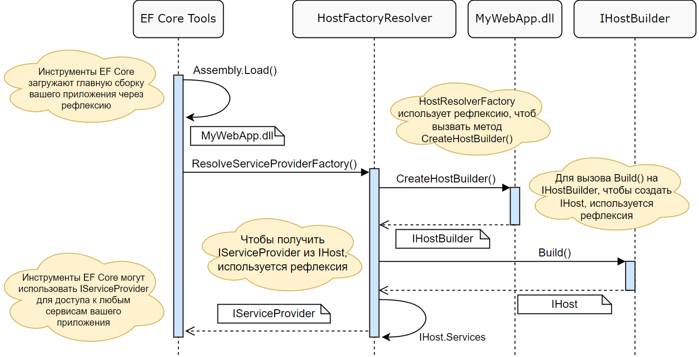
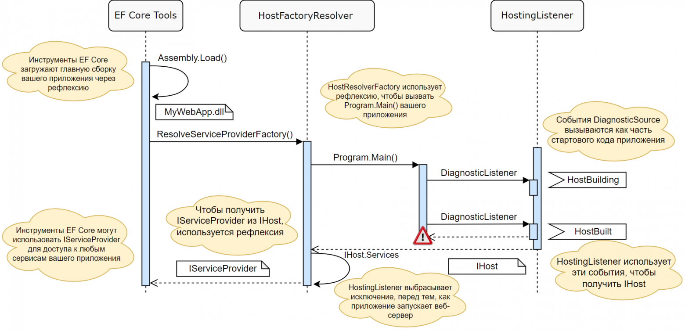

# Исследуем .NET 6–8. Часть 5. Поддержка EF Core в WebApplicationBuilder

**Автор:** Андрей (переводчик), .NET-разработчик  
**Дата публикации:** 27.08.2022 (адаптировано под .NET 6–8)  
**Теги:** .NET, ASP.NET Core, EF Core, WebApplicationBuilder, DiagnosticSource, .NET 6, .NET 8  

Часть 1. ConfigurationManager
Часть 2. WebApplicationBuilder
Часть 3. Рассматриваем код WebApplicationBuilder
Часть 4. Создание конвейера промежуточного ПО в WebApplication

До сих пор в этой серии я рассматривал новые минимальные API хостинга, созданные с использованием WebApplication и WebApplicationBuilder. Они обеспечивают более простую модель для создания веб-приложений, сохраняя при этом те же общие функциональные возможности, что и приложения .NET Core 3.x/5 на основе универсального хоста.

Однако c этим упрощением есть проблемы. Более сложный код запуска в ранних версиях, обычно разделённый между Program.cs и Startup, имел преимущества, так как он предоставлял хорошо известные точки расширения (hooks), которые инструменты могли использовать для перехвата процесса запуска приложения.

Классическим примером этого является инструментарий EF Core*EN. Если вы когда-либо использовали EF Core, возможно, вы знакомы с проблемами, возникающими при попытке изменить код запуска. А уж когда фреймворк меняет свой код запуска по умолчанию, понятно, что без проблем не обойтись!

## Инструменты EF Core в ASP.NET Core 3.x/5

EF Core включает в себя различные инструменты для создания миграций и запуска их в вашей базе данных, но для этого ему необходимо понимать ваш код. По сути, он должен иметь возможность исполнять код запуска вашего приложения, чтобы использовать все настроенные вами сервисы конфигурации и внедрения зависимостей.

В предыдущих версиях ASP.NET Core EF Core подключался к методу CreateWebHostBuilder или CreateHostBuilder в вашем классе Program. Инструменты EF Core искали этот «волшебный» метод для получения доступа к IWebHostBuilder или IHostBuilder, используемый для создания вашего приложения.

```csharp
public static IHostBuilder CreateHostBuilder(string[] args) =>
    Host.CreateDefaultBuilder(args)
        .ConfigureWebHostDefaults(webBuilder =>
        {
            webBuilder.UseStartup<Startup>();
        });
```
Это всегда казалось костылём; если вы переименуете метод или измените его сигнатуру, инструменты EF Core перестанут работать.

Используя этот хорошо известный метод, инструменты EF Core могут загрузить сборку вашего приложения с помощью рефлексии, выполнить метод, получить возвращённый IHostBuilder, вызвать на нем Build() для создания IHost, а затем получить IServiceProvider из свойства IHost.Services! И наконец, используя этот провайдер, проанализировать практически всё, что связано с вашим приложением. Довольно изящно, но сильно зависит от конкретных соглашений.



Так что же произошло, когда ASP.NET Core отказался от всех этих соглашений в .NET 6 с минимальными API хостинга? Ну, в общем, EF Core сломался*EN ?

## Поддержка инструментов EF Core в .NET 6

Конечно, проблема была исправлена, и в этой статье вкратце рассказывается, как Дэвид Фаулер этого добился*EN. В двух словах: он добавил новые события DiagnosticSource во время запуска приложения!

Если вы не знакомы с DiagnosticSource и DiagnosticListener, у меня есть вводный пост об этом здесь*EN, в котором описывается, где их можно использовать для различных способов логирования в .NET Core.

Этому посту уже более 4 лет (в нем даже есть ссылки на project.json!), Но он по-прежнему неплохо описывает, как работает DiagnosticSource.

DiagnosticSource создан в первую очередь как высокопроизводительный способ регистрации расширенных данных, аналогичный отслеживанию событий для Windows (ETW), но полностью внутри процесса. Отправляя события DiagnosticSource как часть процесса создания хоста, Дэвид предоставил инструментам EF Core способ получить доступ к объектам IHostBuilder и IHost. В следующем разделе мы рассмотрим новые события, а далее увидим, как инструменты EF Core их используют.

## Генерация новых событий как часть процесса сборки хоста

В двух предыдущих статьях этой серии я показал, что новые WebApplicationBuilder и WebApplication – это просто оболочки вокруг универсального хоста, представленного в .NET Core 3.0. Дополнительные события DiagnosticSource были добавлены в универсальный HostBuilder, поэтому они применимы как к минимальному хостингу WebApplication, так и к «традиционным» конструкциям универсального хоста.

Это означает, что, если вы продолжите использовать разделение на Program.cs и Startup в .NET 6 и переименуете метод CreateHostBuilder(), инструменты EF Core больше не сломаются!

В следующем блоке кода показан метод HostBuilder.Build() (по состоянию на .NET 6 RC1, несколько адаптированный для удобства чтения). Внесённые изменения относительно просты:

На время действия метода Build() создаётся новый DiagnosticListener.

Если что-либо прослушивает событие Microsoft.Extensions.Hosting.HostBuilding (хост строится), HostBuilder передаёт себя (this) слушателю в качестве параметра

После создания хоста и перед возвратом из метода HostBuilder проверяет, прослушивает ли что-нибудь событие Microsoft.Extensions.Hosting.HostBuilt (хост построен). Если это так, созданный хост передаётся слушателю в качестве параметра.

```csharp
public class HostBuilder : IHostBuilder
{
    public IHost Build()
    {
        using var diagnosticListener = new DiagnosticListener("Microsoft.Extensions.Hosting");
        const string hostBuildingEventName = "HostBuilding";
        const string hostBuiltEventName = "HostBuilt";

        if (diagnosticListener.IsEnabled() && diagnosticListener.IsEnabled(hostBuildingEventName))
        {
            diagnosticListener.Write(hostBuildingEventName, this);
        }

        // Обычный процесс построения 
        BuildHostConfiguration();
        CreateHostingEnvironment();
        CreateHostBuilderContext();
        BuildAppConfiguration();
        CreateServiceProvider();

        var host = _appServices.GetRequiredService<IHost>();
        if (diagnosticListener.IsEnabled() && diagnosticListener.IsEnabled(hostBuiltEventName))
        {
            diagnosticListener.Write(hostBuiltEventName, host);
        }

        return host;
    }
}
```

Добавление этих событий DiagnosticSource не принесёт особой пользы для пользовательских приложений, поскольку в вашем собственном приложении вы, естественно, уже имеете доступ к HostBuilder и построенному IHost. Это пригодится, когда вам нужно запустить приложение с использованием рефлексии, как инструментам EF Core.

## Обновления HostFactoryResolver
У инструментов EF Core непростая задача. Они должны иметь возможность использовать конфигурацию вашего приложения, включая строки подключения, конфигурацию сервиса DI и конфигурацию поставщика БД, при этом не запуская ваше приложение. Для этого они используют вспомогательный класс HostFactoryResolver.

HostFactoryResolver находится в пакете исходного кода (т.е. исходный код копируется и включается в потребляющие проекты) и предоставляет помощников для поиска одной из хорошо известных точек входа для приложений ASP.NET Core в сборке.

До .NET 6 HostFactoryResolver искал точку входа, по одному из следующих названий:
- BuildWebHost
- CreateWebHostBuilder
- CreateHostBuilder

Если он находил в классе точки входа сборки (например, Program) метод с требуемым именем, который возвращал правильный тип и принимал параметр string[], то он вызывал этот метод, используя рефлексию, чтобы получить экземпляр IHostBuilder (или аналогичный). Так инструменты EF Core могли использовать конфигурацию вашего приложения.

В .NET 6 был добавлен новый механизм разрешения, использующий новые события DiagnosticSource. В приведённом ниже коде показан метод ResolveHostFactory, включая все комментарии, поскольку они довольно информативны:

```csharp
// Этот вспомогательный метод инкапсулирует всю сложную логику, необходимую для:
// 1. Выполнения точки входа указанной сборки в другом потоке.
// 2. Ожидания, пока сработают события DiagnosticSource
// 3. Предоставления вызывающей стороне возможности выполнить логику для изменения IHostBuilder
// 4. Разрешения экземпляра IHost приложения
// 5. Предоставления вызывающей стороне возможности определить, завершилась ли точка входа.
public static Func<string[], object>? ResolveHostFactory(
    Assembly assembly, TimeSpan? waitTimeout = null, bool stopApplication = true,
    Action<object>? configureHostBuilder = null, Action<Exception?>? entrypointCompleted = null)
{
    if (assembly.EntryPoint is null)
    {
        return null;
    }

    try
    {
        // Попытка загрузки сборки и проверки версии, чтобы убедиться, что события
        // имеют шанс сработать (они были добавлены в .NET >= 6)
        var hostingAssembly = Assembly.Load("Microsoft.Extensions.Hosting");
        if (hostingAssembly.GetName().Version is Version version && version.Major < 6)
        {
            return null;
        }

        // Мы используем версию >= 6, чтобы события сработали. Если они не срабатывают,
        // это значит, что приложение не использует API хостинга 
    }
    catch
    {
        // Возникла ошибка при загрузке сборки с расширениями, вернуть null. 
        return null;
    }

    return args => new HostingListener(
        args,
        assembly.EntryPoint,
        waitTimeout ?? s_defaultWaitTimeout,
        stopApplication,
        configureHostBuilder,
        entrypointCompleted).CreateHost();
}
```

Этот метод выполняет некоторые начальные проверки, чтобы убедиться, что мы ссылаемся на версию .NET 6+ сборки Microsoft.Extensions.Hosting, и, если да, создаёт экземпляр HostingListener, который является вложенным классом в HostFactoryResolver, где происходит большая часть работы.

Вы можете посмотреть полный исходный код HostingListener на GitHub, но, поскольку это 150 строк, я рассмотрю важные части ниже.

Основная часть работы выполняется с помощью метода CreateHost(), показанного ниже. Этот код отвечает за:

Создание подписки на DiagnosticListener путём регистрации самого HostingListener для получения обратных вызовов. Мы скоро рассмотрим это.

Создание нового потока и запуск точки входа. Это запускает ваше приложение в фоновом потоке и предполагается, что в какой-то момент ваше приложение вызовет HostBuilder.Build().

Идёт ожидание одного из трёх событий:

Наш код слушателя выдаёт исключение StopTheHostException после завершения всей настройки (мы скоро к этому вернёмся)

В вашем приложении возникает иное исключение.

Запуск приложения занимает слишком много времени, поэтому время ожидания метода CreateHost истекает.

После того, как произойдёт что-то из вышеперечисленного, результат передаётся вызывающей стороне, либо в виде возвращённого объекта (т.е. IHost, созданного вашим приложением), либо в виде сгенерированного исключения:

```csharp
private readonly TaskCompletionSource<object> _hostTcs = new();
private readonly MethodInfo _entryPoint;
private static readonly AsyncLocal<HostingListener> _currentListener = new();
private readonly Action<Exception?>? _entrypointCompleted;

public object CreateHost()
{
    using var subscription = DiagnosticListener.AllListeners.Subscribe(this);

    // Запускаем точку входа в новом потоке, чтобы не блокировать текущий
    // на случай, если выполнение вылетит по таймауту 
    var thread = new Thread(() =>
    {
        Exception? exception = null;

        try
        {
            // Устанавливаем async local для экземпляра HostingListener, чтобы мы могли фильтровать события, которые
            // не ограничены этим выполнением точки входа.
            _currentListener.Value = this;

            var parameters = _entryPoint.GetParameters();
            if (parameters.Length == 0)
            {
                _entryPoint.Invoke(null, Array.Empty<object>());
            }
            else
            {
                _entryPoint.Invoke(null, new object[] { _args });
            }

            // Пытаемся установить исключение, если метод точки входа корректно возвращается, это заставит
            // вызывающий код выбросить исключение 
            _hostTcs.TrySetException(new InvalidOperationException("Unable to build IHost"));
        }
        catch (TargetInvocationException tie) when (tie.InnerException is StopTheHostException)
        {
            // Хост был остановлен нашей логикой 
        }
        catch (TargetInvocationException tie)
        {
            exception = tie.InnerException ?? tie;

            // Возникло другое исключение, передаём в вызывающий код 
            _hostTcs.TrySetException(exception);
        }
        catch (Exception ex)
        {
            exception = ex;

            // Возникло другое исключение, передаём в вызывающий код
            _hostTcs.TrySetException(ex);
        }
        finally
        {
            // Сигнализируем, что точка входа исполнена 
            _entrypointCompleted?.Invoke(exception);
        }
    })
    {
        // Надо убедиться, что это не вешает основной процесс
        IsBackground = true
    };

    // Запускаем поток 
    thread.Start();

    try
    {
        // Ждём, прежде чем выбросить исключение 
        if (!_hostTcs.Task.Wait(_waitTimeout))
        {
            throw new InvalidOperationException("Unable to build IHost");
        }
    }
    catch (AggregateException) when (_hostTcs.Task.IsCompleted)
    {
        // Позволяет распространить это из вызова GetAwaiter().GetResult()
    }

    return _hostTcs.Task.GetAwaiter().GetResult();
}
```

Имея только этот код, неясно, как инструменты EF Core могут подключаться к процессу сборки IHostBuilder или как они получают доступ к IHost. Ответ заключается в событиях DiagnosticSource, которые HostingListener получает благодаря вызову DiagnosticListener.AllListeners.Subscribe(this) в предыдущем коде.

```csharp
private sealed class HostingListener : IObserver<DiagnosticListener>, IObserver<KeyValuePair<string, object?>>
{
    private static readonly AsyncLocal<HostingListener> _currentListener = new();

    public void OnNext(DiagnosticListener value)
    {
        if (_currentListener.Value != this)
        {
            // Игнорируем события, не предназначенные для этого слушателя 
            return;
        }

        if (value.Name == "Microsoft.Extensions.Hosting")
        {
            _disposable = value.Subscribe(this);
        }
    }

    public void OnCompleted()
    {
        _disposable?.Dispose();
    }
    // ...
}
```

Когда инициализируется новый DiagnosticListener, слушатель хоста проверяет, что

Мы находимся в том же асинхронном локальном контексте (чтобы избежать проблем с параллелизмом), а если нет, игнорирует слушателя. Мы не будем получать никаких событий от этого слушателя.

Проверяет, называется ли слушатель «Microsoft.Extensions.Hosting», чтобы мы подписывались только на события от HostingBuilder.

После подписки слушателя на события хоста мы будем получать события, когда HostBuilder вызывает diagnosticListener.Write(), как мы видели ранее. Метод OnNext() вызывается с KeyValuePair, содержащим имя события и записанный объект. Так HostingListener может получить доступ к IHostBuilder и IHost! IHostBuilder используется для конфигурации до завершения сборки, а построенный объект IHost передаётся обратно в инструменты EF Core путём установки результата в TaskCompletionSource

private readonly bool _stopApplication;
private readonly TaskCompletionSource<object> _hostTcs = new();
private readonly Action<object>? _configure;

```csharp
public void OnNext(KeyValuePair<string, object?> value)
{
    if (_currentListener.Value != this)
    {
        // Игнорируем события, не предназначенные для этого слушателя
        return;
    }

    if (value.Key == "HostBuilding")
    {
        // выполняем действие, чтобы настроить IHostBuilder, переданный в value.Value
        _configure?.Invoke(value.Value!);
    }

    if (value.Key == "HostBuilt")
    {
        // сохраняем IHost, переданный в value.Value
        _hostTcs.TrySetResult(value.Value!);

        // Инструментам EF Core не надо фактически _запускать_ приложение 
        if (_stopApplication)
        {
            // Предотвращаем дальнейшее исполнение хоста 
            throw new StopTheHostException();
        }
    }
}

private sealed class StopTheHostException : Exception { }
```

Чтобы предотвратить обычную работу приложения (например, прослушивание порта), слушатель выбрасывает исключение StopTheHostException. Поскольку слушатель работает, по сути, внутри приложения, это «выключает» запущенное приложение. HostingListener перехватывает это исключение, сохраняет IServiceProvider и продолжает работу, как в предыдущих версиях платформы.

С этими изменениями инструменты EF Core снова могут получить экземпляр IServiceProvider вашего приложения, фактически запуская ваш Program.Main и выполняя его аварийное завершение после создания IHost.



Это кажется в какой-то степени злоупотреблением DiagnosticSource, но это работает!

## Итого
В этой статье я описал, как инструменты EF Core работают с новым минимальным хостингом WebApplicationBuilder и WebApplication. С этими типами и программами верхнего уровня предыдущие, основанные на соглашениях, подходы EF Core, используемые для загрузки IServiceProvider из вашего приложения, больше не работали бы.

Чтобы обойти эти изменения, в HostBuilder были добавлены новые события DiagnosticSource. Эти события позволяют подписчикам получить доступ к HostBuilder непосредственно перед его построением, а также доступ к экземпляру IHost сразу после его создания.

Инструменты EF Core используют эти события для запуска вашего приложения и получения экземпляра IHost (и связанного IServiceProvider). Затем они генерируют исключение, чтобы ваше приложение фактически не запускалось.


От переводчика  
* Продолжение серии планируется.  
* Дополнение для .NET 8: В .NET 8 поддержка EF Core в WebApplicationBuilder осталась полностью совместимой, с сохранением API DiagnosticSource для инструментов. Это обеспечивает бесперебойную работу миграций и других функций EF Core. Для деталей см. [Microsoft Docs по EF Core](https://learn.microsoft.com/en-us/ef/core/).

## Источники

1. Оригинальная статья: [ссылка на оригинал, если известна]  

**Теги:** .NET, ASP.NET Core, EF Core, WebApplicationBuilder, DiagnosticSource, .NET 6, .NET 8  
**Хабы:** Программирование, .NET, ASP.NET, Веб-разработка, Базы данных