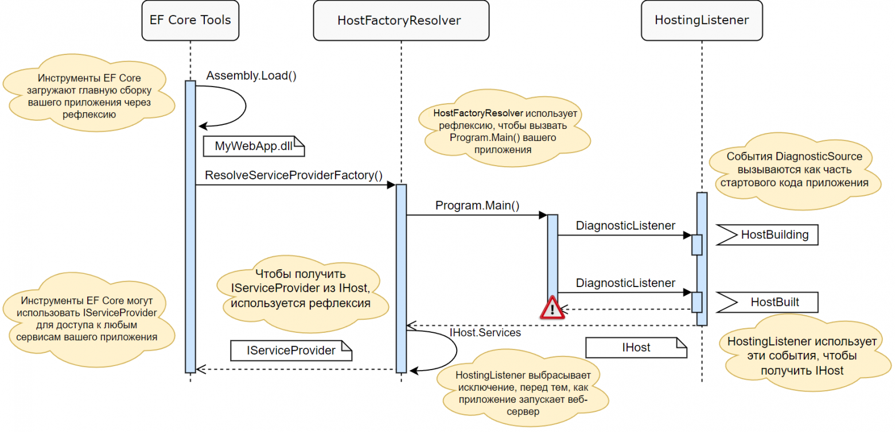
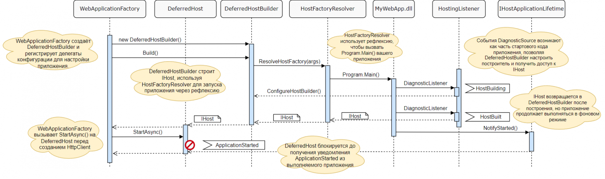

# Исследуем .NET 6–8. Часть 6. Поддержка интеграционных тестов в WebApplicationFactory

**Автор:** Андрей (переводчик), .NET-разработчик  
**Дата публикации:** 27.08.2022 (адаптировано под .NET 6–8)  
**Теги:** .NET, ASP.NET Core, WebApplicationFactory, интеграционные тесты, .NET 6, .NET 8  

Часть 1. ConfigurationManager
Часть 2. WebApplicationBuilder
Часть 3. Рассматриваем код WebApplicationBuilder
Часть 4. Создание конвейера промежуточного ПО в WebApplication
Часть 5. Поддержка EF Core в WebApplicationBuilder

В предыдущей статье я описал обходной путь, который был добавлен в .NET 6, чтобы инструменты EF Core, которые ранее полагались на существование определённых методов, таких как CreateHostBuilder, продолжали работать с новыми минимальными API хостинга.

В этой статье я рассмотрю связанное изменение, обеспечивающее работу интеграционного тестирования с WebApplicationFactory в .NET 6. WebApplicationFactory использовала тот же класс HostFactoryResolver, что и инструменты EF Core, но потребовалось ещё несколько изменений, которые я рассмотрю в этой статье.

## WebApplicationFactory в ASP.NET Core 3.x/5

Существует несколько способов протестировать приложение ASP.NET Core 3.x/5. Один из самых тщательных подходов — написание интеграционных тестов, которые запускают ваше приложение полностью в памяти. Это на удивление легко сделать с помощью пакета Microsoft.AspNetCore.Mvc.Testing и WebApplicationFactory<T>.

Например, следующий код, судя по документации, показывает, как вы можете использовать WebApplicationFactory для создания экземпляра вашего приложения в памяти, создания HttpClient для выполнения запросов и отправки HTTP-запроса в памяти.

```csharp
public class BasicTests : IClassFixture<WebApplicationFactory<Startup>>
{
    private readonly WebApplicationFactory<Startup> _factory;
    public BasicTests(WebApplicationFactory<Startup> factory)
    {
        _factory = factory;
    }

    [Fact]
    public async Task Get_EndpointsReturnSuccessAndCorrectContentType()
    {
        // Arrange
        var client = _factory.CreateClient();

        // Act
        var response = await client.GetAsync("/");

        // Assert
        response.EnsureSuccessStatusCode(); // Status Code 200-299
    }
}
```

Под капотом WebApplicationFactory<T> использует тот же HostFactoryResolver, который я описал в предыдущей статье*EN. Обобщённый параметр TEntryPoint обычно имеет значение Startup, но он просто должен быть одним из типов из входной сборки, чтобы система могла найти метод CreateHostBuilder():

```csharp
public class WebApplicationFactory<TEntryPoint> : IDisposable where TEntryPoint : class
{
    protected virtual IHostBuilder CreateHostBuilder()
    {
        var hostBuilder = HostFactoryResolver.ResolveHostBuilderFactory<IHostBuilder>(typeof(TEntryPoint).Assembly)?.Invoke(Array.Empty<string>());
        if (hostBuilder != null)
        {
            hostBuilder.UseEnvironment(Environments.Development);
        }
        return hostBuilder;
    }
    // ...
}
```

Как я описал в предыдущей статье, HostFactoryResolver использует рефлексию, чтобы найти методы с условными именами CreateHostBuilder() или CreateWebHostBuilder() и вызвать их. Однако в .NET 6 минимальные API хостинга и программы верхнего уровня покончили с этими соглашениями, первоначально нарушив работу WebApplicationFactory (так же, как и EF Core).

## Построение IHost в .NET 6
В предыдущей статье я описал изменения, внесённые в HostBuilder для поддержки HostFactoryResolver, используемого инструментами WebApplicationFactory и EF Core. В первую очередь это было достигнуто за счёт добавления дополнительных событий DiagnosticSource в HostBuilder. Они позволяют HostFactoryResolver получить доступ к HostBuilder без необходимости использовать соглашения предыдущих версий.



WebApplicationFactory также выигрывает от этого нового механизма, но пришлось внести несколько дополнительных изменений. Инструментам EF Core просто необходимо получить доступ к построенному IHost, чтобы извлечь из него IServiceProvider. IServiceProvider фиксируется после создания IHost, поэтому подход «остановки приложения», показанный на изображении выше, работал просто отлично.

Однако это не работает для WebApplicationFactory. WebApplicationFactory должна иметь возможность модифицировать HostBuilder вашего приложения до вызова Build(). Кроме того, она не может просто остановить вашу программу после вызова HostBuilder.Build().

В .NET 6 вы можете писать любой код между вызовами WebApplicationBuilder.Build() и WebApplication.Run(). Вы не можете изменить IServiceCollection, но вы можете зарегистрировать свои конечные точки и промежуточное ПО между этими вызовами:

var builder = WebApplication.CreateBuilder(args);
builder.Services.AddRazorPages();

var app = builder.Build(); // вызывает HostBuilder.Build()

app.UseStaticFiles();

app.MapGet("/", () => "Hello World!");
app.MapRazorPages();

app.Run(); // вызывает Host.StartAsync()
Это немного усложняет работу WebApplicationFactory, так как фабрике нужно выполнить весь код в Program.cs вплоть до вызова app.Run(), поэтому она не может полагаться только на события DiagnosticSource, добавленные в HostBuilder. В оставшейся части этого поста мы рассмотрим, как WebApplicationFactory достигает этого.

## WebApplicationFactory в .NET 6

На первый взгляд, способ использования WebApplicationFactory не изменился в .NET 6. Точно такой же тестовый код, который я показал выше, будет работать в .NET 6, даже если вы используете новые минимальные API хостинга с WebApplication и WebApplicationBuilder.

Одна небольшая неприятность заключается в том, что нет известного класса Startup, который можно было бы использовать в качестве «маркера» для обобщённого параметра T в WebApplicationFactory<T>*EN. На практике это, скорее всего, будет проблемой только для программ уровня «Hello world», поскольку вы можете использовать любой класс в своём веб-приложении в качестве маркера, но об этой особенности следует знать.

WebApplicationFactory предоставляет несколько способов настройки вашего приложения в интеграционных тестах, но по своей сути она предоставляет способ запуска экземпляра хоста вашего приложения в памяти. Один из основных методов в этом процессе — EnsureServer(), который частично показан ниже.

```csharp
public class WebApplicationFactory<TEntryPoint> : IDisposable, IAsyncDisposable where TEntryPoint : class
{
    private void EnsureServer()
    {
        // Нужно убедиться, что мы можем найти .deps.json для приложения
        EnsureDepsFile();

        // Пытаемся создать HostBuilder для приложения, используя по соглашению 
        // метод CreateHostBuilder (в ASP.NET Core 3.x/5) и HostFactoryResolver
        var hostBuilder = CreateHostBuilder();
        if (hostBuilder is not null)
        {
            // Если удалось, применяем настройки к построителю хоста (показано ниже)
            ConfigureHostBuilder(hostBuilder);
            return;
        }

        // Пытаемся создать WebHostBuilder для приложения, используя по соглашению
        // метод CreateWebHostBuilder (в ASP.NET Core 2.x) и HostFactoryResolver
        var builder = CreateWebHostBuilder();
        if (builder is null)
        {
            // Не удалось создать WebHostBuilder, поэтому пробуем подход из .NET 6
            // (показан в следующем разделе)
            // ...
        }
        else
        {
            // успешно создали WebHostBuilder, поэтому применяем настройки и выходим 
            SetContentRoot(builder);
            _configuration(builder);
            _server = CreateServer(builder);
        }
    }

    private void ConfigureHostBuilder(IHostBuilder hostBuilder)
    {
        // Настраиваем веб-хост 
        hostBuilder.ConfigureWebHost(webHostBuilder =>
        {
            SetContentRoot(webHostBuilder);
            _configuration(webHostBuilder);
            // Заменяем Kestrel на TestServer
            webHostBuilder.UseTestServer();
        });
        // Создаём IHost
        _host = CreateHost(hostBuilder);
        // Получаем экземпляр TestServer
        _server = (TestServer)_host.Services.GetRequiredService<IServer>();
    }
}
```

EnsureServer() отвечает за заполнение поля _server типом TestServer с помощью HostFactoryResolver. Сначала он пытается создать экземпляр IHostBuilder через метод Program.CreateHostBuilder(), обычно используемый в ASP.NET Core 3.x/5. Если это не удаётся, он ищет метод Program.CreateWebHostBuilder(), используемый в ASP.NET Core 2.x. Если и это не удается, он прибегает к подходу .NET 6, который я извлёк из описанного выше метода и показал ниже.

```csharp
// Создаём DeferredHostBuilder (его рассмотрим позже)
var deferredHostBuilder = new DeferredHostBuilder();
deferredHostBuilder.UseEnvironment(Environments.Development);

// Убеждаемся, что имя приложения установлено корректно.
// Без этого кода, имя приложения будет установлено как testhost (см. https://github.com/dotnet/aspnetcore/pull/35101)
deferredHostBuilder.ConfigureHostConfiguration(config =>
{
    config.AddInMemoryCollection(new Dictionary<string, string>
    {
        { HostDefaults.ApplicationKey, typeof(TEntryPoint).Assembly.GetName()?.Name ?? string.Empty }
    });
});

// Этот вызов вспомогательного метода выполняет основную работу по определению, можем ли мы вернуться к исходным диагностическим событиям, чтобы получить экземпляр хоста.
var factory = HostFactoryResolver.ResolveHostFactory(
    typeof(TEntryPoint).Assembly,
    stopApplication: false,
    configureHostBuilder: deferredHostBuilder.ConfigureHostBuilder,
    entrypointCompleted: deferredHostBuilder.EntryPointCompleted);

if (factory is not null)
{
    // Если у нас есть фабрика, это значит, что указанная точка входа сборки потенциально может разрешить IHost,
    // поэтому мы устанавливаем фабрику в DeferredHostBuilder, чтобы можно было вызвать её в IHostBuilder.Build.
    deferredHostBuilder.SetHostFactory(factory);

    ConfigureHostBuilder(deferredHostBuilder);
    return;
}

// Не удалось разрешить точку входа .NET 6, выбрасываем исключение 
throw new InvalidOperationException();
```

В этом методе используется новый тип DeferredHostBuilder, который мы вскоре рассмотрим, но важным разделом является вызов HostFactoryResolver.ResolveHostFactory(). Этот метод использует события DiagnosticSource, которые рассматривались в предыдущей статье, для настройки IHostBuilder и доступа к IHost. В частности, вызов регистрирует два обратных вызова:

deferredHostBuilder.ConfigureHostBuilder: вызывается непосредственно перед построением IHostBuilder, ему передаётся экземпляр IHostBuilder.

deferredHostBuilder.EntryPointCompleted: вызывается, если в процессе сборки возникает исключение.

Важно отметить, что для аргумента stopApplication установлено значение false; это гарантирует, что процесс запуска приложения не будет прерван.

Сравните это с подходом для EF Core, в котором stopApplication=true. Инструменты EF Core не хотят запускать ваше приложение, им просто нужен доступ к IHost (и IServiceProvider), поэтому они могут остановить приложение после сборки хоста.

На следующей диаграмме показано взаимодействие WebApplicationFactory с HostFactoryResolver и DeferredHostBuilder, а также с другими типами, которые мы рассмотрим позже. Не беспокойтесь о том, чтобы полностью понять её сейчас, но я думаю, что сейчас полезно рассматривать это как схему того, куда мы идём!



Вы можете удивиться, зачем нам здесь нужен новый тип, DeferredHostBuilder. Он необходим из-за асинхронного способа ожидания завершения работы «основного» приложения. В следующем разделе я подробно рассмотрю этот тип.

## DeferredHostBuilder и ожидание сигнала StartAsync

DeferredHostBuilder — это ещё один IHostBuilder, который был представлен в .NET 6 (наряду с другими)! Он предназначен для «захвата» вызываемых в нём методов конфигурации (например, ConfigureServices()), а затем «воспроизведения» их для IHostBuilder реального приложения, как только он станет доступен.

Эти методы «отсрочки» собирают методы конфигурации в виде мультикаст-делегата, например:

```csharp
internal class DeferredHostBuilder : IHostBuilder
{
    private Action<IHostBuilder> _configure;

    public IHostBuilder ConfigureServices(Action<HostBuilderContext, IServiceCollection> configureDelegate)
    {
        _configure += b => b.ConfigureServices(configureDelegate);
        return this;
    }
    // ...
}
```

Эти делегаты затем применяются к IHostBuilder, когда вызывается событие HostBuilding экземляра DiagnosticSource:

```csharp
public void ConfigureHostBuilder(object hostBuilder)
{
    _configure(((IHostBuilder)hostBuilder));
}
```

Затем WebApplicationFactory вызывает Build() на DeferredHostBuilder. Этот метод, как показано ниже, вызывает метод _hostFactory, возвращаемый HostResolverFactory. Вызов этого метода запускает процесс, описанный в предыдущей статье, в котором приложение выполняется в отдельном потоке, с помощью событий DiagnosticSource вызывается настройка ConfigureHostBuilder() и возвращается экземпляр IHost.

```csharp
public IHost Build()
{
    // Конфигурация хостинга предоставляется через аргументы, чтобы
    // мы могли влиять на приложения, основанные на WebApplicationBuilder.
    var args = new List<string>();

    // Переводим конфигурацию хоста в аргументы командной строки 
    foreach (var (key, value) in _hostConfiguration.AsEnumerable())
    {
        args.Add($"--{key}={value}");
    }

    // Выполняем приложение в отдельном потоке и слушаем события DiagnosticSource
    var host = (IHost)_hostFactory!(args.ToArray());

    // Мы не можем возвратить хост напрямую, потому что нам нужно отложить вызов StartAsync
    return new DeferredHost(host, _hostStartTcs);
}
```

Помните, что приложение в отдельном потоке не перестаёт работать, когда мы извлекаем экземпляр IHost, потому что нам нужно, чтобы остальной код в Program.cs выполнился. DeferredHostBuilder сохраняет IHost в новый тип DefferedHost и возвращает его из вызова Build().

_hostStartTcs — это TaskCompletionSource, который используется для обработки пограничного случая, когда приложение, работающее в фоновом режиме, завершает работу из-за исключения. Это крайний случай, но без него тест может зависнуть на неопределенный срок.

DeferredHost отвечает за ожидание правильного запуска приложения (а не только за сборку IHost). Ему нужно подождать, пока будут настроены все конечные точки, а также исполнится любой дополнительный стартовый код.

DeferredHost достигает этого, используя существующие события IHostApplicationLifetime, которые вызываются в обычном приложении на универсальном хосте при запуске. На следующем изображении (взятом из статьи, посвященной анализу процесса запуска универсального хоста*EN) показано, что метод NotifyStarted() вызывается в IHostApplicationLifetime после запуска сервера.


Вызов NotifyStarted() вызывает событие ApplicationStarted, которое DeferredHost использует для определения того, что приложение запущено, и можно безопасно запускать тесты. Когда WebApplicationFactory вызывает StartAsync() для DeferredHost, DeferredHost блокируется до тех пор, пока не возникнет событие ApplicationStarted.

```csharp
public async Task StartAsync(CancellationToken cancellationToken = default)
{
    // Ждём, пока существующий хост начнёт работать, и дожидаемся этого вызова. 
    // Это позволяет избежать слишком раннего запуска фактического хоста и оставляет приложение ответственным за старт.

    using var reg = cancellationToken.UnsafeRegister(_ => _hostStartedTcs.TrySetCanceled(), null);

    // Если приложение создаст хост, но никогда не вызовет start, это приводит к взаимоблокировке. 
    // Это решается с помощью CancellationToken, но он редко является допустимым токеном для старта.
    using var reg2 = _host.Services.GetRequiredService<IHostApplicationLifetime>().ApplicationStarted.UnsafeRegister(_ => _hostStartedTcs.TrySetResult(), null);

    await _hostStartedTcs.Task.ConfigureAwait(false);
}
```

Метод StartAsync() добавляет дополнительные обратные вызовы к TaskCompletionSource, о которых я упоминал ранее, а затем ожидает задачу перед возвратом. Это заблокирует тестовый код до тех пор, пока не произойдёт одно из трех событий:

Веб-приложение выбросит исключение, которое вызовет функцию обратного вызова EntryPointCompleted() на DeferredHostBuilder и отменит задачу.

CancellationToken, переданный методу StartAsync(), отменится, что отменит задачу.

Приложение запустится, вызвав событие ApplicationStarted, завершив задачу успехом.

Как отмечено в комментариях к этому методу, если вы никогда не вызываете Start() или Run() в своем веб-приложении (и не генерируете исключение), это приведёт к взаимоблокировке, но тогда у вас, скорее всего, не будет действительного веб-приложения, так что это не большая проблема.

Вот и всё! После вызова Start() WebApplicationFactory создаёт HttpClient, как и в предыдущих версиях, и вы можете выполнять вызовы в памяти, как и раньше. Стоит знать, что (в отличие от предыдущих версий ASP.NET Core) в ваших тестах будет исполнено всё, что содержится в Program.cs. Но, помимо этого нюанса, всё в вашем тестовом коде останется прежним.

## Итого

В этой статье я описал изменения, сделанные в WebApplicationFactory для поддержки новых минимальных API хостинга, использующих WebApplication и WebApplicationBuilder. Изменения потребовались, потому что в Program.cs больше нет «обычных» методов, которые можно вызывать с помощью рефлексии, а также внутри Program.cs происходит настройка вашего промежуточного программного обеспечения и конечных точек.

Чтобы обойти эту проблему, WebApplicationFactory использует те же события DiagnosticSource, что и инструменты EF Core из предыдущей статьи, для настройки IHostBuilder и получения IHost. Однако, в отличие от инструментов EF Core, WebApplicationFactory не останавливает приложение после сборки IHost. Вместо этого она позволяет приложению продолжить работу и прослушивает событие IHostApplicationLifetime.ApplicationStarted. Это позволяет WebApplicationFactory блокироваться до тех пор, пока не будет выполнен весь код в Program.cs и приложение не будет готово начать обработку запросов.
```

От переводчика  
* Продолжение серии планируется.  
* Дополнение для .NET 8: В .NET 8 поддержка интеграционных тестов с WebApplicationFactory осталась полностью совместимой, с сохранением API и механизма DiagnosticSource. Это обеспечивает бесперебойную работу тестов, включая улучшения в производительности хоста и поддержке Native AOT для тестовых сценариев. Для деталей см. [Microsoft Docs по тестированию в ASP.NET Core](https://learn.microsoft.com/en-us/aspnet/core/test/integration-tests).

## Источники

1. Оригинальная статья: [ссылка на оригинал, если известна]  

**Теги:** .NET, ASP.NET Core, WebApplicationFactory, интеграционные тесты, DiagnosticSource, .NET 6, .NET 8  
**Хабы:** Программирование, .NET, ASP.NET, Веб-разработка, Тестирование, Базы данных