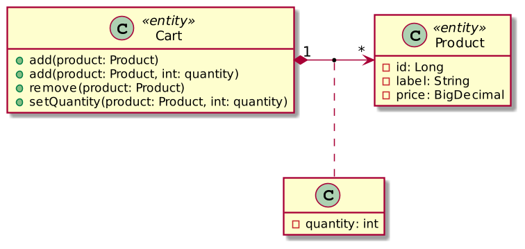
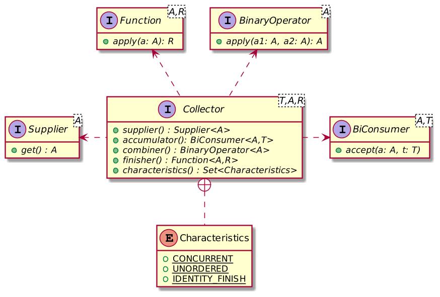

# Использование интерфейса Collector в реальных проектах
[ссылка](https://habr.com/ru/companies/ruvds/articles/557666/) на статью.

Автор статьи, перевод которой мы публикуем сегодня, хочет рассказать о том, как интерфейс Collector и сопутствующие механизмы используются в реальных проектах.

В Java-программировании при работе с потоками широкое применение находят методы класса Collectors. Эти методы позволяют возвращать либо объекты, в основе которых лежит базовый класс Collection, либо — скалярные значения. В первом случае, то есть — для возврата коллекций, применяют один из методов, имя которого выглядит как toXXX(), а во втором случае используется, например, метод reducing().

Представим себе интернет-магазин, в котором есть корзина. Модель корзины выглядит так, как показано ниже.


*Модель корзины*

Если перевести эту диаграмму классов в код, опустив некоторые детали, то получится следующее.

Вот код класса Product, представляющего товар:

```java
public class Product {

    private final Long id;                           // 1
    private final String label;                      // 1
    private final BigDecimal price;                  // 1

    public Product(Long id, String label, BigDecimal price) {
        this.id = id;
        this.label = label;
        this.price = price;
    }

    @Override
    public boolean equals(Object object) { … }        // 2

    @Override
    public int hashCode() { … }                       // 2
}
```

**Объяснения к коду:**
1. Здесь и далее в коде будут использоваться комментарии в виде чисел, подробности о которых будут приводиться после блока кода.
2. Геттеры. Методы, которые зависят лишь от id.

Вот — код класса Cart, символизирующего корзину:

```java
public class Cart {

    private final Map<Product, Integer> products = new HashMap<>(); // 1

    public void add(Product product) {
        add(product, 1);
    }

    public void add(Product product, int quantity) {
        products.merge(product, quantity, Integer::sum);
    }

    public void remove(Product product) {
        products.remove(product);
    }

    public void setQuantity(Product product, int quantity) {
        products.put(product, quantity);
    }

    public Map<Product, Integer> getProducts() {
        return Collections.unmodifiableMap(products);           // 2
    }
}
```

**Объяснения к коду:**
1. Товары организованы в виде словаря. Его ключами являются объекты класса Product, а значениями — количества товаров.
2. Не забудем о том, что для обеспечения инкапсуляции данных нужно вернуть копию коллекции, предназначенную только для чтения.

После того, как мы описали порядок хранения данных в памяти, нам нужно создать механизмы вывода корзины на экран. Мы знаем о том, что при оформлении заказа пользователю нужно сообщить о двух характеристиках этого заказа:

- Нужно вывести список строк, в каждой из которых содержится наименование товара и его цена, представляющая собой произведение количества заказанного товара на цену одной единицы товара.
- Нужно вывести общую стоимость заказа.

Вот код, описывающий строку со сведениями о товаре и о цене всех заказанных товаров определённого вида:

```java
public record CartRow(Product product, int quantity) {          // 1

    public CartRow(Map.Entry<Product, Integer> entry) {
        this(entry.getKey(), entry.getValue());
    }

    public BigDecimal getRowPrice() {
        return product.getPrice().multiply(new BigDecimal(quantity));
    }
}
```

**Объяснения к коду:**
1. CartRow — это объект-значение. Смоделировать его можно, взяв за основу запись (record) Java 16.

```java
var rows = cart.getProducts()
    .entrySet()
    .stream()
    .map(CartRow::new)
    .collect(Collectors.toList());                          // 1

var price = cart.getProducts()
    .entrySet()
    .stream()
    .map(CartRow::new)
    .map(CartRow::getRowPrice)                               // 2
    .reduce(BigDecimal.ZERO, BigDecimal::add);               // 3
```

**Объяснения к коду:**
1. Собрать список строк.
2. Вычислить цену для каждой строки.
3. Вычислить общую стоимость заказа.

Одно из основных ограничений, сопутствующих работе с Java-потоками, заключается в том, что использовать их можно лишь единожды. Причина этого заключается в том, что объекты, на основе которых создают потоки, необязательно являются иммутабельными (хотя они и могут быть таковыми). В результате повторная обработка потока может оказаться операцией, не являющейся идемпотентной.

В результате — для того чтобы узнать и цену товаров в отдельных строках, и общую стоимость заказа, нам нужно создавать на основе объекта корзины два потока. Из одного мы получаем сведения о строках, из второго — сведения о ценах.

Это — не особенно удачный способ решения нашей задачи.

Мы хотели бы получить из одного потока и сведения о строках с данными о товарах и их ценах, и сведения, необходимые для подсчёта полной стоимости товаров, находящихся в корзине. Для этого нам нужна собственная реализация интерфейса Collector, которая, за один проход, возвращает нам и то и другое в виде одного объекта.

```java
public class PriceAndRows {

    private BigDecimal price;                                 // 1
    private final List<CartRow> rows = new ArrayList<>();     // 2

    PriceAndRows(BigDecimal price, List<CartRow> rows) {
        this.price = price;
        this.rows.addAll(rows);
    }

    PriceAndRows() {
        this(BigDecimal.ZERO, new ArrayList<>());
    }
}
```

**Объяснения к коду:**
1. Итоговая стоимость заказа.
2. Список строк, в которых могут выводиться названия товаров, цена за единицу товара и общая стоимость товаров одного вида.

Вот — общие сведения об интерфейсе Collector. Подробности о нём можно почитать [здесь](https://docs.oracle.com/javase/8/docs/api/java/util/stream/Collector.html) или [здесь](https://blog.frankel.ch/custom-collectors-java-8/).



*Интерфейс Collector*

| Интерфейс | Описание |
|-----------|----------|
| `supplier()` | Предоставляет базовый объект, контейнер, используемый для работы с потоком значений. |
| `accumulator()` | Описывает порядок накопления в контейнере значений, поступающих из потока. |
| `combiner()` | Если работа ведётся с двумя потоками — описывает порядок их объединения. |
| `finisher()` | Если тип мутабельного контейнера не является возвращаемым типом — описывает порядок преобразования контейнера в возвращаемый тип. |
| `characteristics()` | Предоставляет метаданные для оптимизации работы с потоками. |

Теперь мы можем реализовать интерфейс Collector:

```java
private class PriceAndRowsCollector
    implements Collector<Map.Entry<Product, Integer>, PriceAndRows, PriceAndRows> {

    @Override
    public Supplier<PriceAndRows> supplier() {
        return PriceAndRows::new;                                 // 1
    }

    @Override
    public BiConsumer<PriceAndRows, Map.Entry<Product, Integer>> accumulator() {
        return (priceAndRows, entry) -> {                         // 2
            var row = new CartRow(entry);
            priceAndRows.price = priceAndRows.price.add(row.getRowPrice());
            priceAndRows.rows.add(row);
        };
    }

    @Override
    public BinaryOperator<PriceAndRows> combiner() {
        return (c1, c2) -> {                                      // 3
            c1.price = c1.price.add(c2.price);
            var rows = new ArrayList<>(c1.rows);
            rows.addAll(c2.rows);
            return new PriceAndRows(c1.price, rows);
        };
    }

    @Override
    public Function<PriceAndRows, PriceAndRows> finisher() {
        return Function.identity();                             // 4
    }

    @Override
    public Set<Characteristics> characteristics() {
        return Set.of(Characteristics.IDENTITY_FINISH);         // 4
    }
}
```

**Объяснения к коду:**
1. Мутабельный контейнер является экземпляром PriceAndRows.
2. Поместить в контейнер типа PriceAndRows элемент словаря, содержащий сведения о товаре и о его количестве.
3. Два объекта типа PriceAndRows можно скомбинировать, суммировав общую стоимость товаров, хранящихся в них, и агрегировав соответствующие строки.
4. Мутабельный контейнер может быть возвращён в неизменном виде.

Проектирование собственной реализации интерфейса Collector может оказаться не самым простым делом, но пользоваться такой реализацией достаточно просто:

```java
var priceAndRows = cart.getProducts()
    .entrySet()
    .stream()
    .collect(new PriceAndRowsCollector());
```

## Итоги

Большинство задач, касающихся работы с потоками и коллекциями, можно решить, используя стандартные методы класса Collectors. Но иногда возникает необходимость в создании собственной реализации интерфейса Collector, например — тогда, когда нужно наладить работу не с одной, а с несколькими коллекциями, или когда в итоге нужно получить не одно, а несколько скалярных значений.

Хотя, если раньше вы подобным не занимались, это и может показаться сложным, на самом деле, всё не так уж и сложно. Нужно лишь немного практики. Надеюсь, этот материал поможет вам научиться работать с классом Collectors и с интерфейсом Collector.

Код проекта, который мы рассматривали, в формате Maven, можно найти в [этом репозитории](https://github.com/ajavageek/custom-collector/).
