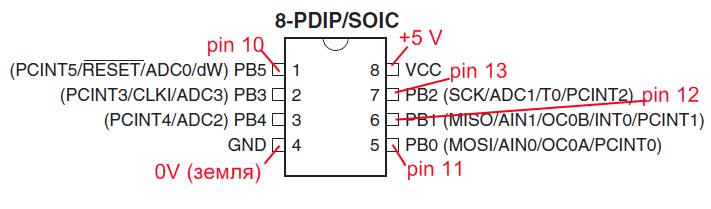

# Прошивка ATtiny13A с помощью Arduino Nano: пошаговое руководство

**Дата публикации:** 14.04.2021  
**Теги:** Microcontrollers, Arduino, ATtiny13a, ISP, прошивка  

ATtiny13A — компактный и энергоэффективный микроконтроллер, идеальный для простых проектов. В этой статье мы разберем, как прошить ATtiny13A с помощью Arduino Nano, используя его как ISP-программатор. Процесс включает настройку Arduino Nano, установку необходимых библиотек и загрузку скетча. Это руководство подходит для начинающих и позволит быстро запустить ваш проект.

## Шаг 1: Настройка Arduino Nano как ISP-программатора

Сначала преобразуем Arduino Nano в программатор для SPI-интерфейса ATtiny13A.

1. Подключите Arduino Nano к компьютеру через USB-кабель.
2. Откройте Arduino IDE.
3. Загрузите скетч ArduinoISP: перейдите в меню "Файл" → "Примеры" → "ArduinoISP".
4. Выберите плату Arduino Nano: "Инструменты" → "Плата" → "Arduino AVR Boards" → "Arduino Nano".
5. Выберите COM-порт платы Arduino Nano: "Инструменты" → "Порт" → "COMx", где x — номер вашего порта (проверьте в диспетчере устройств).
6. Загрузите скетч в Arduino Nano, нажав кнопку "Загрузка".

После этого Arduino Nano готов выступать в роли программатора.

## Шаг 2: Настройка среды разработки для ATtiny13A

Теперь добавим поддержку ATtiny13A в Arduino IDE.

1. Установите файлы для ATtiny13A: в Arduino IDE перейдите в "Файл" → "Настройки". В поле "Дополнительные ссылки для Менеджера плат" добавьте URL: `https://raw.githubusercontent.com/sleemanj/optiboot/master/dists/package_gogo_diy_attiny_index.json`. Если ссылки уже есть, разделите их запятой и пробелом.
2. Откройте "Менеджер плат": "Инструменты" → "Плата" → "Менеджер плат".
3. Найдите и установите "DIY ATtiny": прокрутите вниз, найдите "DIY ATtiny" и нажмите "Установка".

## Шаг 3: Подключение ATtiny13A к Arduino Nano

Соберите схему подключения. Для иллюстрации см. изображение attiny13a_pinout_program.png.

- ATtiny13A: подключите выводы 4 (GND) и 8 (VCC) к соответствующим выводам Arduino Nano.
- Выводы SPI ATtiny13A (5 — MOSI, 6 — MISO, 7 — SCK) подключите к соответствующим выводам Arduino Nano: D11 (MOSI), D12 (MISO), D13 (SCK).
- Подключите вывод 1 (RESET) ATtiny13A к выводу D10 (RESET) Arduino Nano через резистор 10 кОм.
- Добавьте конденсатор 100nF между выводами 1 (RESET) и 8 (VCC) ATtiny13A.

Подключите Arduino Nano к компьютеру после сборки схемы.

## Шаг 4: Загрузка кода в ATtiny13A

Теперь загрузим скетч в микроконтроллер.

1. Выберите плату и порт: в Arduino IDE выберите "Инструменты" → "Плата" → "ATtiny13" (или аналогичный пункт для вашего варианта) и "Инструменты" → "Порт" → "COMx", где x — номер порта Arduino Nano.
2. Выберите программатор: "Инструменты" → "Программатор" → "Arduino as ISP".
3. Загрузите ваш скетч в ATtiny13A: нажмите кнопку "Загрузка".

Пример простого скетча для мигания светодиодом (подключите светодиод к выводу PB0 или PB1):

```cpp
void setup() {
  pinMode(PB0, OUTPUT);  // Или PB1 (вывод 6)
}

void loop() {
  digitalWrite(PB0, HIGH);
  delay(1000);
  digitalWrite(PB0, LOW);
  delay(1000);
}
```

После успешной загрузки код будет работать на ATtiny13A. Если возникнут проблемы, проверьте подключение и настройки порта.

## Примечания

- Убедитесь, что вы выбрали правильный COM-порт для Arduino Nano.
- Выберите программатор "Arduino as ISP".
- Для работы со светодиодом используйте выводы PB0 (вывод 5) или PB1 (вывод 6).
- Для отладки можно использовать последовательный монитор, подключив вывод 7 ATtiny13A к выводу 7 Arduino Nano (если он не используется для других целей).

Этот метод позволяет легко программировать ATtiny13A без дополнительных устройств. Экспериментируйте с кодом и наслаждайтесь разработкой!

**Ссылки:**
- [ArduinoISP пример в Arduino IDE](https://www.arduino.cc/en/Tutorial/ArduinoISP)
- [DIY ATtiny на GitHub](https://github.com/sleemanj/optiboot/tree/master/dists)

