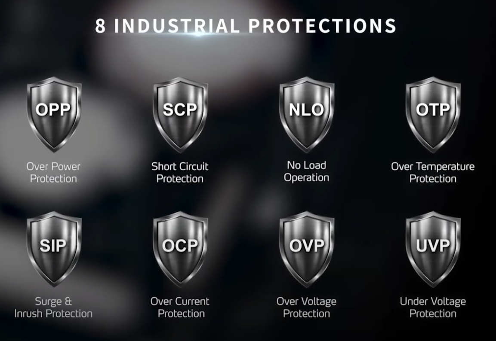

# 8 промышленных защит (protections). 

Они обычно используются в источниках питания, блоках электроники или промышленном оборудовании, чтобы предотвратить поломки, перегрев или повреждения от неисправностей. Я опишу их доступным языком, как будто рассказываю другу.

### 1. **OPP (Over Power Protection) — Защита от перегрузки по мощности**
   Это как предохранитель от "слишком много энергии". Если устройство потребляет больше мощности, чем оно может выдержать (например, из-за короткого замыкания или перегрузки), система автоматически выключает питание, чтобы ничего не сгорело.

### 2. **SCP (Short Circuit Protection) — Защита от короткого замыкания**
   Представь, что провода "соприкасаются" неправильно, и ток идёт по короткому пути, вызывая искры или перегрев. Эта защита мгновенно отключает питание, чтобы предотвратить пожар или повреждение компонентов.

### 3. **NLO (No Load Operation) — Операция без нагрузки**
   Это не совсем "защита", а функция работы устройства без подключённой нагрузки (например, когда ничего не потребляет энергию). Оно позволяет блоку питания работать стабильно вхолостую, без риска нестабильности или повреждений, но с контролем, чтобы не тратить лишнюю энергию.

### 4. **OTP (Over Temperature Protection) — Защита от перегрева**
   Если устройство нагревается слишком сильно (из-за плохой вентиляции или перегрузки), эта защита выключает его, как термостат в духовке. Это спасает от плавления деталей или пожара.

### 5. **SIP (Surge Input Protection или Soft Inrush Protection) — Защита от импульсов на входе (или мягкий пуск)**
   Защищает от внезапных "скачков" напряжения на входе (например, от молнии или нестабильной сети). Или, если это "мягкий пуск", то предотвращает резкий бросок тока при включении, чтобы не шокировать систему.

### 6. **OCP (Over Current Protection) — Защита от перегрузки по току**
   Если ток становится слишком большим (больше, чем положено), это как автомат в розетке: система ограничивает или отключает его, чтобы провода не расплавились и компоненты не вышли из строя.

### 7. **OVP (Over Voltage Protection) — Защита от перенапряжения**
   Когда напряжение в сети "взлетает" выше нормы (например, из-за скачка), эта защита блокирует лишнее напряжение, как барьер, чтобы не "поджарить" чувствительную электронику.

### 8. **UVP (Under Voltage Protection) — Защита от пониженного напряжения**
   Если напряжение падает слишком низко (слабая сеть или разряд батареи), система отключает питание, чтобы устройство не работало нестабильно и не повредилось от "грязного" низкого тока.

Эти защиты делают оборудование надёжным и безопасным в промышленных условиях, где всё может пойти наперекосяк. Если это из конкретного устройства (например, блока питания), уточни — могу углубить!